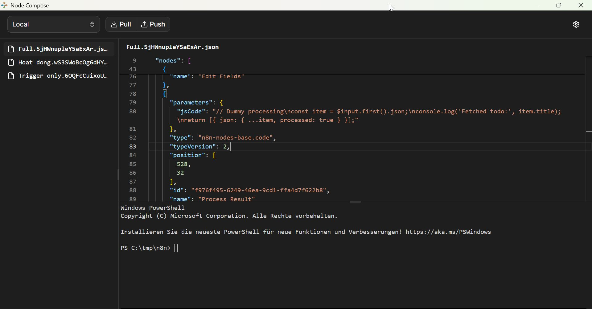
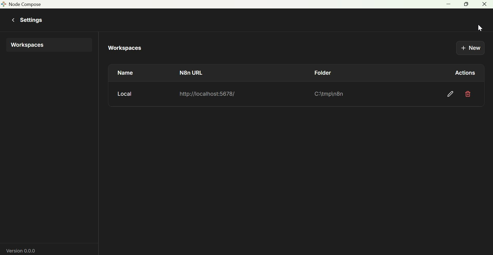

# Node Compose

Node Compose is a desktop app for checking out n8n workflows as JSON files, editing them with coding agents, and syncing them back to n8n.

## Why This App Exists

When building workflows with coding agents, it is often faster to work with versioned JSON files than to edit everything directly in the n8n UI. Node Compose gives you a local, Git-friendly workflow:

- Pull workflows from n8n into local JSON files.
- Use coding agents and your editor workflow to iterate quickly.
- Review and resolve conflicts between local and remote changes.
- Push validated updates back to n8n.

## Core Features

- Workspace management for multiple n8n environments.
- Pull / Push workflow synchronization.
- Conflict detection with side-by-side JSON diff.
- Embedded editor and terminal for agent-assisted workflow development.
- Desktop runtime (Electron) with local file operations and PTY terminal support.

## Screenshots

### Home



### Settings



## Tech Stack

- React + TypeScript + Vite
- Electron
- Monaco Editor
- xterm.js
- Zustand

## Getting Started

### Prerequisites

- Node.js 20+
- npm
- Git (required so Node Compose can track local workflow changes and commits)

### Install

```bash
npm install
```

### Run the app

```bash
npm run start
```

This command builds the renderer and launches Electron.

## Build a Windows Package

```bash
npm run electron:build
```

Output artifacts are written to the release folder.

## Typical Workflow

1. Create or select a workspace with n8n URL and API key.
2. Pull workflows from n8n.
3. Edit workflow JSON locally with coding agents.
4. Resolve conflicts when local and remote differ.
5. Push updates back to n8n.
